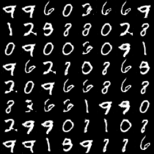
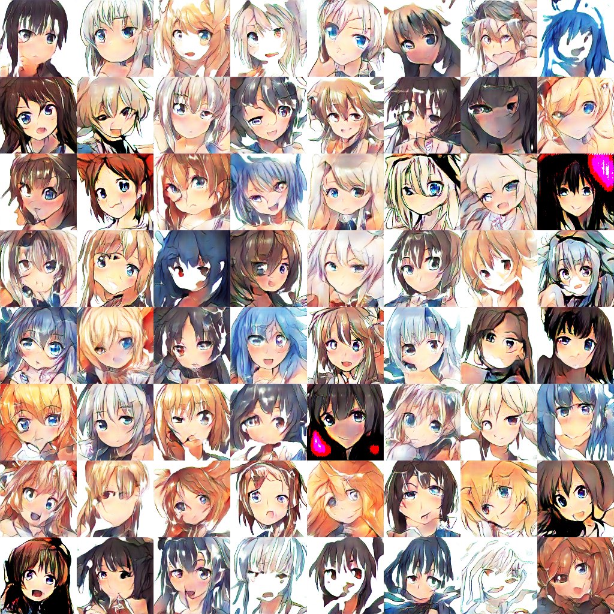
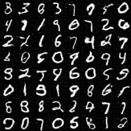
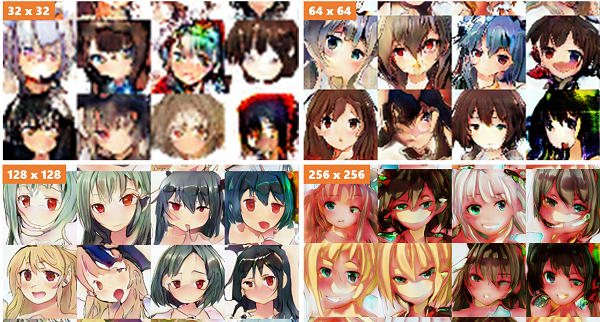

# tf-gans
Major GANs are implemented in this repository :fire:

## Environments
* python 3.6
* tensorflow 1.11

I use eager execution !!

## Dataset
* MNIST
* CIFAR10
* Anime Face dataset

## Implemented
* [Vanilla GAN](https://github.com/salty-vanilla/tf-gans/tree/master/impl/vanilla_gan)
* [WGAN](https://github.com/salty-vanilla/tf-gans/tree/master/impl/wgan)
* [WGAN-GP](https://github.com/salty-vanilla/tf-gans/tree/master/impl/wgan_gp)
* [SNGAN](https://github.com/salty-vanilla/tf-gans/tree/master/impl/sngan)
* [PGGAN](https://github.com/salty-vanilla/tf-gans/tree/master/impl/pggan)

## To Implement
* Conditional GAN
* ACGAN
* cGANs with projection discriminator
* SAGAN

## Overview of the results
| | MNIST | CIFAR10 | Anime |
|-|-|-|-|
| Vanilla GAN |  | TBA | TBA |
| WGAN |  | TBA | TBA |
| WGAN-GP |  | TBA |  |
| SNGAN |  | TBA | TBA |
| PGGAN | TBA | TBA |  |
| Conditional GAN | TBA | TBA | TBA |
| ACGAN | TBA | TBA | TBA |
| cGANs   with projection discriminator | TBA | TBA | TBA |
| SAGAN | TBA | TBA | TBA |
