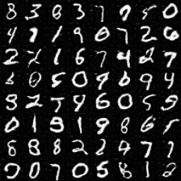

# SNGAN
Spectral Normalization for Generative Adversarial Networks
[[paper]](https://arxiv.org/abs/1802.05957)  

## Environments
* python 3.6
* tensorflow 1.11

## Experiments
* MNIST

### Generated samples

