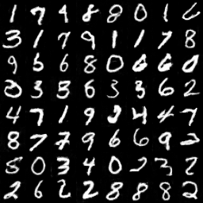

# Vanilla GAN
Generative Adversarial Nets
[[paper]](https://papers.nips.cc/paper/5423-generative-adversarial-nets)  
Unsupervised Representation Learning with Deep Convolutional Generative Adversarial Networks
[[paper]](https://arxiv.org/abs/1511.06434)  

## Environments
* python 3.6
* tensorflow 1.11

## Experiments
* MNIST

### Generated samples

